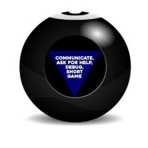

# Working with APIs

## Dog API

Create and use a component with a button that that will load a random dog image and put it on the page. Use `fetch()` to retrieve thatThe API for a random dog image is here:

https://dog.ceo/api/breeds/image/random

Other conditions to implement:
* If there is no image set, hide the image.
* While the image is loading, display a loading state on the page.
* Load a random dog image as soon as the component is put on the page.

## Random User Component

Use the Random User Generator API to create a User Information Card
* Create a UserCard Component
* Use the Random User Generator API to return a single user: https://randomuser.me/api/?results=1
* Use the data from the Random User Generator to populate the UserCard Component

#### Bonus
* Load multiple user cards based on multiple users from Random User Generator (check the API docs to make this request!)
* Add a button to fetch a new group of users from the API

## Magic Eight Ball

Build a React component that takes user input and consults the Magic Eight Ball API: [https://8ball.delegator.com/](https://8ball.delegator.com/)

It must:

* Accept user input in the form of a question (**HINT**: Controlled Inputs!).
* Returns the response from Magic Eight Ball.
* Make the answer _look like the Magic Eight Ball image_.

#### Bonus

* Add CSS Animations to "shake" the ball when a question is asked (**HINT**: Maybe via a `className` change?)